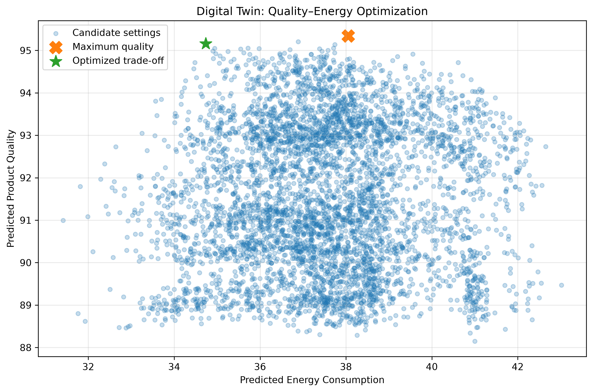

# AI-Based Manufacturing Digital Twin

An AI-driven Digital Twin prototype for intelligent manufacturing process monitoring, product quality prediction, energy optimization, closed-loop control, fault detection, and automatic recovery.

The project combines machine learning, process simulation, optimization, and feedback control to demonstrate how a Digital Twin can support data-driven manufacturing decisions.

---

## Project Overview

This project implements an AI-based manufacturing Digital Twin using machine learning and data-driven process simulation.

The system models the relationship between manufacturing operating parameters, product quality, and energy consumption. Two Random Forest regression models are used to predict process outcomes, while optimization and closed-loop control are applied to identify and maintain improved operating conditions.

A simulated disturbance is also introduced to evaluate fault detection and automatic recovery capabilities.

---

## Key Capabilities

- Manufacturing process simulation
- AI-based product quality prediction
- AI-based energy consumption prediction
- Feature importance analysis
- Multi-objective quality-energy optimization
- Optimized operating-point recommendation
- Real-time process monitoring
- Closed-loop process control
- Manufacturing fault detection
- Automatic disturbance recovery
- KPI monitoring and visualization
- AI model and result export

---

## Digital Twin Workflow

The project follows the general workflow:

```text
Manufacturing Process Data
          |
          v
   Data Preprocessing
          |
          v
 Machine Learning Models
     /             \
    v               v
Quality Model    Energy Model
     \             /
      \           /
       v         v
   Process Prediction
          |
          v
 Multi-Objective Optimization
          |
          v
 Optimized Operating Point
          |
          v
   Closed-Loop Control
          |
          v
 Fault Detection & Recovery
          |
          v
     KPI Evaluation
```

---

## Machine Learning Models

Two Random Forest regression models are used:

1. **Product Quality Prediction Model**
2. **Energy Consumption Prediction Model**

### Input Parameters

The models use the following manufacturing process variables:

- Temperature
- Pressure
- Machine Speed
- Material Ratio

---

## Model Performance

### Product Quality Model

| Metric | Result |
| --- | ---: |
| MAE | ~0.889 |
| R² Score | ~0.689 |

### Energy Consumption Model

| Metric | Result |
| --- | ---: |
| MAE | ~1.293 |
| R² Score | ~0.652 |

These models provide the predictive layer used by the Digital Twin for process evaluation and optimization.

---

## Optimized Manufacturing Settings

The optimization stage produced the following operating point:

| Parameter | Optimized Value |
| --- | ---: |
| Temperature | ~439.138 °C |
| Pressure | ~4.227 bar |
| Machine Speed | ~115.360 |
| Material Ratio | ~0.318 |
| Predicted Quality | ~95.159 |
| Predicted Energy Consumption | ~34.736 |

The optimization objective is to identify manufacturing settings that provide a favorable balance between product quality and energy consumption.

---

## Quality-Energy Optimization

The project performs multi-objective optimization using predictions from the trained machine learning models.

The optimization process searches the manufacturing operating space and evaluates candidate settings according to predicted product quality and energy consumption.

The resulting operating point is then used as the target for closed-loop process control.

### Optimization Result



---

## Closed-Loop Process Control

The Digital Twin uses AI predictions and optimized targets to automatically adjust manufacturing operating parameters.

### Final Closed-Loop Results

| KPI | Initial | Final |
| --- | ---: | ---: |
| Product Quality | 95.108 | 95.145 |
| Energy Consumption | 35.045 | 34.737 |

Additional results:

- **Quality Improvement:** ~0.037 points
- **Energy Reduction:** ~0.307 units
- **Energy Saving:** ~0.88%

These results demonstrate the use of predictive models and optimized targets within a feedback-control loop.

---

## Fault Detection and Automatic Recovery

A simulated manufacturing disturbance was introduced to evaluate the fault-management capability of the Digital Twin.

### After Disturbance

- Product Quality: ~91.236
- Energy Consumption: ~35.651

### After Automatic Recovery

- Product Quality: ~95.163
- Energy Consumption: ~34.734
- Quality Recovered: ~3.927 points
- Recovery Energy Reduction: ~0.917 units

The system reached the acceptable recovery region at **control cycle 14**.

This demonstrates the ability of the simulated Digital Twin to detect degraded process conditions and generate corrective operating parameters.

---

## Final System Status

**SUCCESS**

The Digital Twin successfully:

1. Detected the simulated manufacturing disturbance
2. Evaluated its impact using AI models
3. Generated corrective operating parameters
4. Executed closed-loop recovery
5. Returned the manufacturing process to the optimized region

---

## Project Structure

```text
mini-digital-twin-manufacturing/
│
├── data/
│   ├── manufacturing_process_data.csv
│   └── optimized_manufacturing_settings.csv
│
├── figures/
│   └── quality_energy_optimization.png
│
├── notebooks/
│   └── 01_digital_twin_manufacturing.ipynb
│
├── results/
│   ├── closed_loop_control_history.csv
│   ├── digital_twin_final_kpi_report.csv
│   ├── energy_prediction_model.pkl
│   ├── fault_recovery_history.csv
│   ├── optimized_manufacturing_settings.csv
│   └── quality_prediction_model.pkl
│
├── .gitignore
├── README.md
└── requirements.txt
```

---

## Technologies

The project uses:

- Python
- NumPy
- Pandas
- Matplotlib
- Scikit-learn
- Random Forest Regression
- Jupyter Notebook
- Joblib

---

## Installation

Clone the repository:

```bash
git clone https://github.com/khaterehparvanian/mini-digital-twin-manufacturing.git
```

Move into the project directory:

```bash
cd mini-digital-twin-manufacturing
```

Install the required Python packages:

```bash
pip install -r requirements.txt
```

---

## Running the Project

Start Jupyter Notebook:

```bash
jupyter notebook
```

Then open:

```text
notebooks/01_digital_twin_manufacturing.ipynb
```

Run the notebook cells sequentially to reproduce the Digital Twin workflow and results.

---

## Generated Outputs

The project generates several output artifacts, including:

### Trained Models

```text
results/quality_prediction_model.pkl
results/energy_prediction_model.pkl
```

### Optimization Results

```text
results/optimized_manufacturing_settings.csv
```

### Closed-Loop Control History

```text
results/closed_loop_control_history.csv
```

### Fault-Recovery History

```text
results/fault_recovery_history.csv
```

### Final KPI Report

```text
results/digital_twin_final_kpi_report.csv
```

---

## Potential Applications

This proof-of-concept demonstrates concepts relevant to:

- Smart Manufacturing
- Industry 4.0
- AI-Based Manufacturing
- Digital Twin Systems
- Intelligent Process Control
- Energy-Efficient Manufacturing
- Predictive Process Monitoring
- Fault Detection and Recovery
- Industrial Decision Support Systems

---

## Limitations

This project is a simulation-based proof of concept.

The manufacturing dataset and disturbances are synthetic. Therefore, the reported model performance and control results should not be interpreted as validated performance on a physical industrial production system.

Deployment in a real manufacturing environment would require real sensor/process data, industrial validation, integration with control infrastructure, and appropriate safety constraints.

---

## Future Development

Possible extensions include:

- Integration with real-time industrial sensor data
- IoT/OPC-UA data acquisition
- Time-series process modeling
- Advanced anomaly detection
- Predictive maintenance
- Dynamic optimization
- Model uncertainty estimation
- Real-time dashboards
- Integration with PLC/SCADA systems
- Deployment of the Digital Twin as an API or industrial monitoring service

---

## Disclaimer

The manufacturing dataset and disturbances used in this project are synthetic and are intended for simulation, education, and proof-of-concept development.